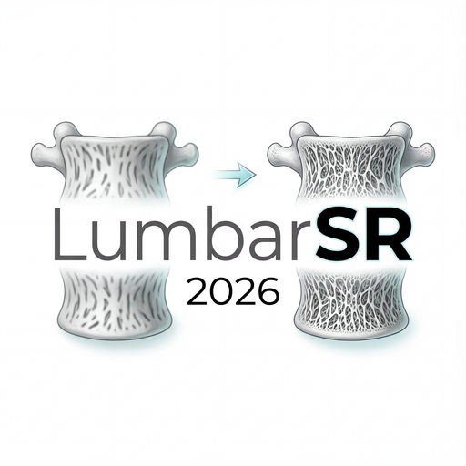
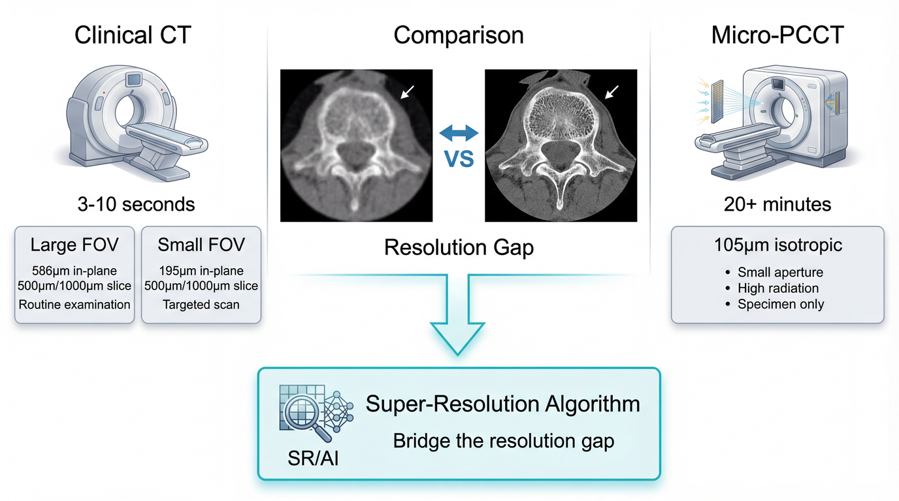

# Lumbar Vertebral Super-Resolution Structure Reconstruction Challenge

<p align="center">
  
</p>

<p align="center">
  <a href="https://creativecommons.org/licenses/by-nc-sa/4.0/"></a>
  
  
  
</p>

## Overview

Medical computed tomography (CT) plays a crucial role in disease diagnosis, with CT technology having undergone significant evolution over the past half-century—from primary CT to energy-integrating detector CT, and now to photon-counting detector CT (PCCT) systems being deployed in clinical centers worldwide. Low back pain is a prevalent symptom affecting approximately 540 million people globally at any given time, with lumbar vertebral microstructure changes being a potential osseous factor contributing to this condition. However, these microstructural morphological changes remain largely undetectable due to current limitations in standard clinical CT equipment resolution.

This challenge addresses the critical need for algorithms capable of reconstructing high-resolution bone microstructure from paired regular clinical helical CT lumbar vertebral images to match the quality of state-of-the-art Micro-PCCT. The LumbarSR challenge provides a unique dataset of 30 paired human dry lumbar vertebrae scanned with both clinical helical CT (at multiple resolution and reconstruction configurations) and Micro-PCCT at 0.1mm super-resolution. This novel benchmark enables development and evaluation of super-resolution reconstruction algorithms in musculoskeletal imaging, with potential applications in osteoporosis screening, fracture risk assessment, and low back pain investigation.

The technical objective is to develop algorithms that can transform clinical helical CT images (0.5-1.0 mm resolution) into high-resolution images comparable to Micro-PCCT (0.1 mm), representing a 10-200× super-resolution enhancement factor. Success in this challenge could transform routine lumbar CT scans into diagnostic tools for bone microstructure assessment, advancing AI-based image reconstruction in musculoskeletal radiology.

<p align="center">
  <a href="docs/images/showcase.gif">
    
  </a>
  <br>
  <em>Tri-planar views and 3D bone rendering across different CT resolutions (<a href="docs/images/showcase.gif">Full resolution</a>)</em>
</p>

## Task Description

Given clinical CT images acquired with **soft tissue reconstruction kernel** at two different fields of view (FOV):
- **Small FOV** (195um in-plane resolution)
- **Large FOV** (586um in-plane resolution)

Reconstruct the corresponding high-resolution Micro-PCCT image (105um isotropic resolution).

<p align="center">
  <a href="docs/images/flowchart.png">
    
  </a>
  <br>
  <em>Challenge pipeline overview (<a href="docs/images/flowchart.png">Full resolution</a>)</em>
</p>

## Dataset

### Download

**[Download Dataset (tar.gz)](https://drive.google.com/file/d/1mPK0_i15XPzp1pyydV2uhsMfBuYGjJGy/view?usp=sharing)**

The dataset is provided as a compressed tar.gz archive. After downloading, extract it using:

```bash
# Extract the dataset
tar -xzf LumbarSR_Dataset.tar.gz

# This will create a LumbarSR/ directory with the following structure
```

### Directory Structure

```
LumbarSR/
├── original_dicom/              # Original DICOM data
│   ├── Lumbar_01/
│   │   ├── clinical_ct/
│   │   │   ├── 195X_195Y_500Z_S/      # Small FOV, soft kernel
│   │   │   ├── 195X_195Y_1000Z_S/     # Small FOV, soft kernel
│   │   │   ├── 586X_586Y_500Z_S/      # Large FOV, soft kernel
│   │   │   └── 586X_586Y_1000Z_S/     # Large FOV, soft kernel
│   │   └── micro_ct/
│   │       └── *.dcm                   # Original Micro-PCCT DICOM
│   ├── Lumbar_02/
│   │   └── ...
│   └── Lumbar_30/
│       └── ...
├── registered_nifti/            # Processed NIfTI data (ready to use)
│   ├── Lumbar_01/
│   │   ├── Lumbar01_ClinicalCT_195X_195Y_500Z_S_registered.nii.gz
│   │   ├── Lumbar01_ClinicalCT_195X_195Y_1000Z_S_registered.nii.gz
│   │   ├── Lumbar01_ClinicalCT_586X_586Y_500Z_S_registered.nii.gz
│   │   ├── Lumbar01_ClinicalCT_586X_586Y_1000Z_S_registered.nii.gz
│   │   └── Lumbar01_MicroPCCT_105um.nii.gz                          # Ground truth
│   ├── Lumbar_02/
│   │   └── ...
│   └── Lumbar_30/
│       └── ...
└── README.md
```

**Key Points:**
- `original_dicom/`: Contains raw DICOM files for advanced users who want to process from scratch
- `registered_nifti/`: Pre-processed and registered NIfTI files, ready for training (recommended starting point)
- All clinical CT sequences are rigidly registered to the Micro-PCCT space
- Ground truth files are named `*_MicroPCCT_105um.nii.gz`

### Data Split

| Split | Samples | Clinical CT | Micro-PCCT |
|-------|---------|-------------|------------|
| Training | 30 | Paired | Paired |
| Validation Phase 1 | 5 | Paired | Paired |
| Validation Phase 2 | 5 | Available | Hidden |

### Input Data (Clinical CT)

For each sample, we provide 4 sequences with soft tissue kernel:

| Sequence | In-plane Resolution | Slice Thickness | FOV |
|----------|---------------------|-----------------|-----|
| 195X_195Y_500Z_S | 195um | 500um | Small |
| 195X_195Y_1000Z_S | 195um | 1000um | Small |
| 586X_586Y_500Z_S | 586um | 500um | Large |
| 586X_586Y_1000Z_S | 586um | 1000um | Large |

### Ground Truth (Micro-PCCT)

- Resolution: 105um isotropic
- Format: NIfTI (.nii.gz)
- Data type: int16 (Hounsfield Units)

### Dataset Statistics

- **Training Set**: 30 samples, 212,805 slices total (avg 7,093.5 slices/case, registered to 105μm isotropic)

## Evaluation Metrics

### Image Quality Metrics

The following metrics are computed under **two CT window settings** (Bone, Soft Tissue) in **masked mode** (non-air region only):

- **PSNR** (Peak Signal-to-Noise Ratio) - measured in dB, higher is better ↑
- **SSIM** (Structural Similarity Index) - range [0, 1], higher is better ↑
- **MAE** (Mean Absolute Error) - lower is better ↓

### Local Bone Contrast (LBC)

LBC is a microstructure-specific metric that measures the local intensity dynamic range within bone regions using a sliding window approach. It quantifies how well the super-resolution result preserves fine bone microstructure details (e.g., trabecular bone boundaries).

**Computation:**
1. A 16×16 pixel sliding window (stride 8) scans across bone mask regions (HU > -500)
2. Within each window, the percentile dynamic range P95 − P5 is computed
3. The mean dynamic range across all valid windows gives the LBC value (in HU)
4. **LBC Ratio** = Pred_LBC / GT_LBC (closer to 1.0 is better)

Higher LBC indicates sharper bone-air boundaries and better microstructure visibility. The LBC Ratio measures how much of the ground truth's local contrast is preserved by the super-resolution method.

### CT Window Settings

All image quality metrics (PSNR, SSIM, MAE) are computed under two CT window settings:

| Window | Window Center (WC) | Window Width (WW) | Description |
|--------|-------------------|-------------------|-------------|
| Bone | 400 | 1800 | Bone structure visualization |
| Soft Tissue | 40 | 400 | Soft tissue visualization |

### Ranking System

The final ranking is determined by **average rank** across four metric categories:

| Rank Category | Metric | Direction | Description |
|---------------|--------|-----------|-------------|
| PSNR Rank | Mean of 4 PSNR values | ↑ Higher is better | 2 windows × 2 FOV, masked mode |
| SSIM Rank | Mean of 4 SSIM values | ↑ Higher is better | 2 windows × 2 FOV, masked mode |
| MAE Rank | Mean of 4 MAE values | ↓ Lower is better | 2 windows × 2 FOV, masked mode |
| LBC Rank | Mean LBC Ratio | ↑ Closer to 1.0 is better | Across all input sequences |

**Final Score = (PSNR_Rank + SSIM_Rank + MAE_Rank + LBC_Rank) / 4**

The team with the **lowest average rank** wins. In case of a tie, the LBC Rank is used as the tiebreaker.

## Getting Started

### Quick Start with Docker

The easiest way to get started is using Docker:

```bash
# Clone repository
git clone https://github.com/frankzhangrp/LumbarSR-Challenge.git
cd LumbarSR-Challenge

# Build Docker image (includes PyTorch, MONAI, medical imaging libraries)
docker build -t lumbarsr:latest .

# Run container with GPU support
docker run --gpus all -it \
  -v $(pwd)/data:/workspace/data \
  -v $(pwd)/results:/workspace/results \
  lumbarsr:latest
```

Or use docker-compose:

```bash
docker-compose up -d
docker-compose exec lumbarsr bash
```

### Local Installation

Alternatively, install dependencies locally:

```bash
pip install -r requirements.txt
```

Required packages:
- PyTorch ≥ 2.0
- MONAI ≥ 1.2
- nibabel, pydicom, SimpleITK
- numpy, scipy, scikit-image

## Baseline Methods

We provide three baseline implementations in the [`methods/`](methods/) directory:

### 1. Interpolation Baselines

Traditional interpolation methods (no training required):

```bash
# Run bicubic interpolation (recommended baseline)
python methods/interpolation.py \
  --method bicubic \
  --data-root ./data/registered_nifti \
  --output-root ./results
```

Available methods: `nearest`, `trilinear`, `bicubic`, `lanczos`

### 2. SRCNN (Super-Resolution CNN)

Deep learning approach with ~60K parameters:

```bash
# Training
python methods/train.py \
  --model srcnn \
  --data-root ./data/registered_nifti \
  --output-dir ./checkpoints \
  --dual-channel \
  --epochs 100 \
  --batch-size 4

# Inference
python methods/inference.py \
  --model srcnn \
  --checkpoint checkpoints/srcnn_best.pth \
  --data-root ./data/registered_nifti \
  --output-root ./results
```

### 3. UNet

U-shaped architecture with encoder-decoder and skip connections (~30M parameters):

```bash
# Training
python methods/train.py \
  --model unet \
  --data-root ./data/registered_nifti \
  --output-dir ./checkpoints \
  --dual-channel \
  --epochs 100 \
  --batch-size 4

# Inference
python methods/inference.py \
  --model unet \
  --checkpoint checkpoints/unet_best.pth \
  --data-root ./data/registered_nifti \
  --output-root ./results
```

### Baseline Performance

**Experimental Setup:**
- **Training Set**: Lumbar_01 to Lumbar_25 (25 samples)
- **Test Set**: Lumbar_26 to Lumbar_30 (5 samples)
- **Training**: Deep learning methods trained on 25 samples with dual-channel input
- **Evaluation**: Metrics computed as mean ± standard deviation across test set

#### PSNR Results (dB) ↑

| Method | Small FOV (195μm × 195μm) | | | | | | Large FOV (586μm × 586μm) | | | | | |
|--------|---|---|---|---|---|---|---|---|---|---|---|---|
| | **Full** | | | **Masked** | | | **Full** | | | **Masked** | | |
| | Raw | Bone | Soft | Raw | Bone | Soft | Raw | Bone | Soft | Raw | Bone | Soft |
| **Baseline** | 21.94±0.67 | 18.94±0.45 | 17.20±0.38 | 11.86±0.77 | 8.85±0.61 | 7.12±0.61 | 22.01±0.66 | 18.98±0.41 | 17.30±0.34 | 12.04±0.67 | 9.01±0.50 | 7.33±0.51 |
| **UNet** | 21.94±0.67 | 18.94±0.45 | 17.20±0.38 | 11.86±0.77 | 8.85±0.61 | 7.12±0.61 | 22.01±0.66 | 18.98±0.41 | 17.30±0.34 | 12.04±0.67 | 9.01±0.50 | 7.33±0.51 |
| **SRCNN** | **23.64±0.50** | **20.04±0.39** | **18.00±0.35** | **12.87±0.35** | **9.26±0.32** | 7.22±0.30 | **23.99±0.58** | **20.31±0.42** | **18.07±0.37** | **13.18±0.38** | **9.50±0.27** | 7.25±0.21 |
| **Nearest** | 23.74±0.54 | 20.11±0.42 | 18.00±0.36 | 13.04±0.35 | 9.40±0.30 | 7.29±0.26 | 23.71±0.54 | 20.19±0.41 | 18.00±0.36 | 13.03±0.34 | 9.51±0.26 | 7.31±0.23 |

#### SSIM Results ↑

| Method | Small FOV (195μm × 195μm) | | | | | | Large FOV (586μm × 586μm) | | | | | |
|--------|---|---|---|---|---|---|---|---|---|---|---|---|
| | **Full** | | | **Masked** | | | **Full** | | | **Masked** | | |
| | Raw | Bone | Soft | Raw | Bone | Soft | Raw | Bone | Soft | Raw | Bone | Soft |
| **Baseline** | 0.92±0.00 | 0.94±0.00 | 0.95±0.00 | 0.92±0.00 | 0.94±0.00 | 0.95±0.00 | 0.92±0.00 | 0.94±0.00 | 0.95±0.00 | 0.92±0.00 | 0.94±0.00 | 0.95±0.00 |
| **UNet** | 0.93±0.01 | 0.95±0.00 | 0.95±0.00 | 0.93±0.01 | 0.95±0.00 | **0.95±0.00** | **0.94±0.00** | **0.95±0.00** | **0.95±0.00** | **0.94±0.00** | **0.95±0.00** | **0.95±0.00** |
| **SRCNN** | 0.93±0.00 | 0.95±0.00 | 0.95±0.00 | 0.93±0.00 | 0.95±0.00 | 0.95±0.00 | 0.93±0.00 | 0.95±0.00 | 0.95±0.00 | 0.93±0.00 | 0.95±0.00 | 0.95±0.00 |
| **Nearest** | 0.92±0.00 | 0.94±0.00 | 0.95±0.00 | 0.92±0.00 | 0.94±0.00 | 0.95±0.00 | 0.92±0.00 | 0.94±0.00 | 0.95±0.00 | 0.92±0.00 | 0.94±0.00 | 0.95±0.00 |

#### MAE Results ↓

| Method | Small FOV (195μm × 195μm) | | | | | | Large FOV (586μm × 586μm) | | | | | |
|--------|---|---|---|---|---|---|---|---|---|---|---|---|
| | **Full** | | | **Masked** | | | **Full** | | | **Masked** | | |
| | Raw | Bone | Soft | Raw | Bone | Soft | Raw | Bone | Soft | Raw | Bone | Soft |
| **Baseline** | 0.01±0.00 | 0.02±0.00 | 0.02±0.00 | 0.15±0.02 | 0.19±0.03 | 0.21±0.03 | 0.01±0.00 | 0.02±0.00 | 0.02±0.00 | 0.14±0.02 | 0.18±0.02 | 0.20±0.02 |
| **UNet** | **0.01±0.00** | 0.01±0.00 | 0.02±0.00 | 0.14±0.01 | 0.18±0.01 | 0.21±0.01 | **0.01±0.00** | **0.02±0.00** | **0.02±0.00** | **0.14±0.01** | 0.18±0.01 | 0.21±0.01 |
| **SRCNN** | **0.01±0.00** | **0.02±0.00** | **0.02±0.00** | **0.14±0.01** | **0.18±0.01** | **0.21±0.01** | **0.01±0.00** | **0.02±0.00** | **0.02±0.00** | **0.14±0.01** | **0.18±0.01** | **0.21±0.01** |
| **Nearest** | 0.01±0.00 | 0.02±0.00 | 0.02±0.00 | 0.15±0.02 | 0.19±0.03 | 0.21±0.03 | 0.01±0.00 | 0.02±0.00 | 0.02±0.00 | 0.14±0.02 | 0.18±0.02 | 0.20±0.02 |

**Key Findings:**
- **SRCNN** achieves the best PSNR across most configurations (8-9% improvement over baseline)
- **UNet** excels at structural preservation with the highest SSIM scores
- All interpolation methods (Nearest) perform identically to baseline since input/output dimensions match
- **Masked evaluation** (focusing on anatomical regions) shows more discriminating metrics than full-image evaluation
- Deep learning methods show consistent improvements in both Small and Large FOV configurations

For detailed instructions, see [`methods/README.md`](methods/README.md).

## Submission

Details coming soon.

## Timeline

> **Note**: Schedule is tentative and subject to change.

| Milestone | Date |
|-----------|------|
| Challenge website launch | April 1-10, 2026 |
| Training data release | April 15, 2026 |
| Registration opens | April 15, 2026 |
| Validation data release | May 1, 2026 |
| Submission system opens | June 1, 2026 |
| Public test phase begins | July 1, 2026 |
| Submission deadline | August 15, 2026 |
| Hidden test evaluation | August 16-31, 2026 |
| Results notification | September 5, 2026 |
| Challenge Event | TBD |

## Training Data Policy

1. **Challenge Data**: Participants are encouraged to use the official LumbarSR training set as the core development data.

2. **External Data (Allowed)**: To maximize performance, external datasets are allowed for pre-training and/or supplementary training (public or legally/ethically permitted institutional data). Teams must disclose the external data sources in their method description (name/type and approximate scale).

3. **Pre-trained / Foundation Models (Allowed)**: Use of any publicly available pre-trained models and foundation models is permitted. Model name/version (or checkpoint) must be disclosed.

4. **Synthetic Data (Allowed)**: Synthetic data generation (e.g., augmentation, simulation, self-training) is allowed and should be briefly described.

5. **Fair-Play / No Test Leakage**: No use of hidden test ground truth or any form of test-set leakage. Inference must be fully automatic with no case-by-case manual tuning.

## Organizers

- **Ruipeng Zhang**, Institute of Diagnostic and Interventional Radiology, Shanghai Sixth People's Hospital Affiliated to Shanghai Jiao Tong University School of Medicine
- **Ping Wang**, Institute of Diagnostic and Interventional Radiology, Shanghai Sixth People's Hospital Affiliated to Shanghai Jiao Tong University School of Medicine
- **Mengfei Wang**, School of Information and Intelligent Science, Donghua University
- **Zhenzhen Cao**, Basic Medical Science, Kunming Medical University
- **Xuefei Hu**, Basic Medical Science, Tarim University School of Medicine
- **Yuehua Li**✉, Institute of Diagnostic and Interventional Radiology, Shanghai Sixth People's Hospital Affiliated to Shanghai Jiao Tong University School of Medicine (liyuehua77@sjtu.edu.cn)

## Citation

If you use this dataset, please cite:

```bibtex
@misc{lumbarsr2026,
  title={LumbarSR: Lumbar Vertebral Super-Resolution Structure Reconstruction Challenge},
  year={2026},
  url={https://github.com/frankzhangrp/LumbarSR-Challenge}
}
```

## Contact

- Email: zhangrp@sjtu.edu.cn
- GitHub: [@frankzhangrp](https://github.com/frankzhangrp)

## License

This dataset is released under [CC BY-NC-SA 4.0](https://creativecommons.org/licenses/by-nc-sa/4.0/).
