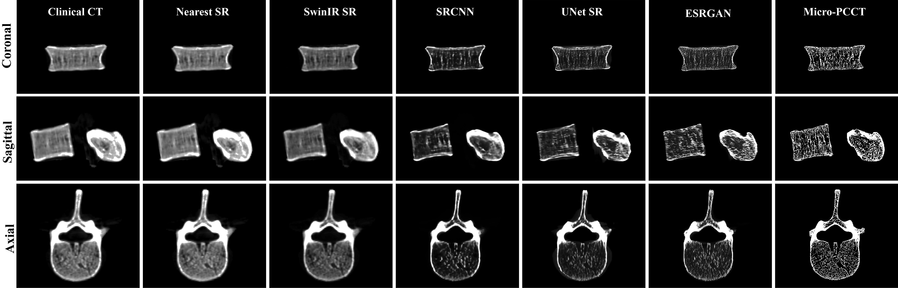
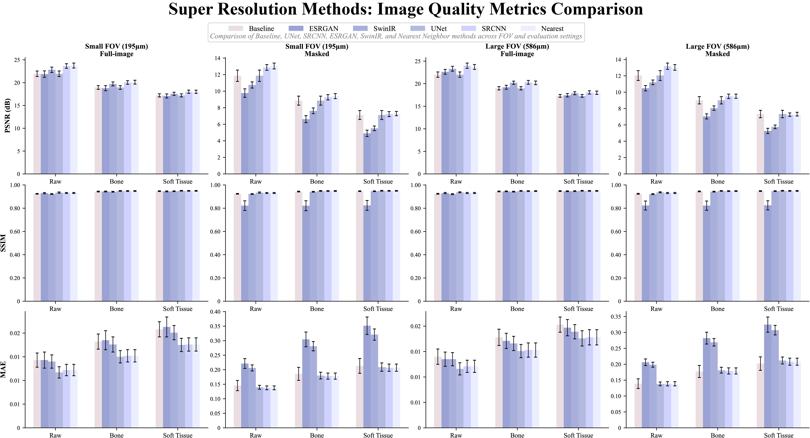

# LumbarSR: A Paired Clinical CT and Photon-Counting Micro-CT Dataset for Human Lumbar Vertebrae

<p align="center">
  
</p>

<p align="center">
  <a href="https://creativecommons.org/licenses/by-nc-sa/4.0/"></a>
  
  
  
</p>

## News

- Our manuscript, **"LumbarSR: A Paired Clinical CT and Photon-Counting Micro-CT Dataset for Human Lumbar Vertebrae,"** has been accepted for publication in *Scientific Data*.

## Overview

LumbarSR is a paired clinical CT and Micro-PCCT benchmark for lumbar vertebral super-resolution. It contains 30 ex vivo human lumbar samples scanned with multiple clinical CT configurations and matched `105 μm` Micro-PCCT.

The benchmark targets reconstruction of bone microstructure from routine clinical CT into Micro-PCCT-like resolution for musculoskeletal imaging research.

<p align="center">
  <a href="docs/images/showcase.gif">
    
  </a>
  <br>
  <em>Tri-planar views and 3D bone rendering across different CT resolutions (<a href="docs/images/showcase.gif">Full resolution</a>)</em>
</p>

## Task Description

Given clinical CT images with **soft tissue kernel** at two FOV settings (`195 μm` and `586 μm` in-plane), reconstruct the corresponding `105 μm` isotropic Micro-PCCT target.

<p align="center">
  <a href="docs/images/flowchart.png">
    
  </a>
  <br>
  <em>Pipeline overview (<a href="docs/images/flowchart.png">Full resolution</a>)</em>
</p>

## Super-Resolution Visualization

<p align="center">
  <a href="docs/images/sr_visualization_lumbar26_586um.pdf">
    
  </a>
  <br>
  <em>Representative tri-planar super-resolution comparison on <code>Lumbar_26</code> with <code>586X_586Y_1000Z_S</code> input. Columns from left to right: Clinical CT, Nearest, SwinIR, SRCNN, UNet, ESRGAN, and Micro-PCCT target (<a href="docs/images/sr_visualization_lumbar26_586um.pdf">PDF</a>).</em>
</p>

## Dataset

### Download

**[Download Dataset from Zenodo (ZIP parts)](https://doi.org/10.5281/zenodo.19404387)**

[](https://doi.org/10.5281/zenodo.19404387)

The dataset is distributed on Zenodo as split ZIP archives. Please use the Zenodo record for the current file list and download instructions.

### Directory Structure

```
LumbarSR/
├── original_dicom/              # Original DICOM data
│   ├── Lumbar_01/
│   │   ├── clinical_ct/
│   │   │   ├── 195X_195Y_500Z_S/      # Small FOV, soft kernel
│   │   │   ├── 195X_195Y_1000Z_S/     # Small FOV, soft kernel
│   │   │   ├── 586X_586Y_500Z_S/      # Large FOV, soft kernel
│   │   │   └── 586X_586Y_1000Z_S/     # Large FOV, soft kernel
│   │   └── micro_ct/
│   │       └── *.dcm                   # Original Micro-PCCT DICOM
│   ├── Lumbar_02/
│   │   └── ...
│   └── Lumbar_30/
│       └── ...
├── RegisteredData/              # Processed NIfTI data (ready to use)
│   ├── Lumbar_01/
│   │   ├── Lumbar01_ClinicalCT_195X_195Y_500Z_S_registered.nii.gz
│   │   ├── Lumbar01_ClinicalCT_195X_195Y_1000Z_S_registered.nii.gz
│   │   ├── Lumbar01_ClinicalCT_586X_586Y_500Z_S_registered.nii.gz
│   │   ├── Lumbar01_ClinicalCT_586X_586Y_1000Z_S_registered.nii.gz
│   │   └── Lumbar01_MicroPCCT_105um.nii.gz                          # Ground truth
│   ├── Lumbar_02/
│   │   └── ...
│   └── Lumbar_30/
│       └── ...
├── BoneMask/                    # Released binary bone ROI aligned to RegisteredData
│   ├── Lumbar_01/
│   │   ├── Lumbar01_MicroPCCT_105um_BoneMask.nii.gz
│   │   ├── Lumbar01_ClinicalCT_195X_195Y_500Z_B_registered_BoneMask.nii.gz
│   │   ├── Lumbar01_ClinicalCT_195X_195Y_500Z_S_registered_BoneMask.nii.gz
│   │   ├── Lumbar01_ClinicalCT_195X_195Y_1000Z_B_registered_BoneMask.nii.gz
│   │   ├── Lumbar01_ClinicalCT_195X_195Y_1000Z_S_registered_BoneMask.nii.gz
│   │   ├── Lumbar01_ClinicalCT_586X_586Y_500Z_B_registered_BoneMask.nii.gz
│   │   ├── Lumbar01_ClinicalCT_586X_586Y_500Z_S_registered_BoneMask.nii.gz
│   │   ├── Lumbar01_ClinicalCT_586X_586Y_1000Z_B_registered_BoneMask.nii.gz
│   │   └── Lumbar01_ClinicalCT_586X_586Y_1000Z_S_registered_BoneMask.nii.gz
│   ├── Lumbar_02/
│   │   └── ...
│   └── Lumbar_30/
│       └── ...
└── README.md
```

`RegisteredData/` is the recommended starting point. `BoneMask/` provides binary ROIs aligned to the released NIfTI volumes. Each sample contains one `MicroPCCT` mask and eight sequence-level clinical masks.

### Recommended Split

| Usage | Samples |
|-------|---------|
| Training / development | `Lumbar_01` to `Lumbar_25` |
| Reference test set | `Lumbar_26` to `Lumbar_30` |

### Input Data (Clinical CT)

For each sample, we provide 4 sequences with soft tissue kernel:

| Sequence | In-plane Resolution | Slice Thickness | FOV |
|----------|---------------------|-----------------|-----|
| 195X_195Y_500Z_S | 195um | 500um | Small |
| 195X_195Y_1000Z_S | 195um | 1000um | Small |
| 586X_586Y_500Z_S | 586um | 500um | Large |
| 586X_586Y_1000Z_S | 586um | 1000um | Large |

Micro-PCCT targets are released as `int16` NIfTI volumes at `105 μm` isotropic resolution.

## Evaluation Metrics

### CT Window Settings

Image-quality metrics are reported within the released `BoneMask` ROI under three CT windows:

| Window | Window Center (WC) | Window Width (WW) | Description |
|--------|-------------------|-------------------|-------------|
| Raw | - | - | Original HU values (-1024 ~ 3071) |
| Bone | 400 | 1800 | Bone structure visualization |
| Soft Tissue | 40 | 400 | Soft tissue visualization |

## Getting Started

### Environment Setup

```bash
git clone https://github.com/frankzhangrp/LumbarSR-Challenge.git
cd LumbarSR-Challenge

conda create -n lumbarsr python=3.10 -y
conda activate lumbarsr

pip install --upgrade pip
pip install -r requirements.txt
```

Main dependencies: PyTorch, MONAI, nibabel, pydicom, SimpleITK, numpy, scipy, and scikit-image.

## Repository Contents

The public repository currently contains four main parts:

| Directory | Status | Description |
|-----------|--------|-------------|
| `baseline/` | Public | Rigid registration baseline based on ANTs, including `register_ants.py` and `batch_register.py` |
| `methods/` | Public | Super-resolution method scripts and usage notes |
| `evaluation/` | Public | Image quality evaluation and trabecular summary scripts |
| `docs/` | Public | GitHub Pages website, visualizations, and benchmark result pages |

The public benchmark reports results for registered clinical CT, nearest interpolation, `SRCNN`, `UNet`, `ESRGAN`, and `SwinIR` under the released `BoneMask`-ROI protocol. Reproducible usage commands are documented in [`methods/README.md`](methods/README.md) and the scripts under [`evaluation/`](evaluation/).

## Registration Baseline and Mask Evaluation

The public repository includes rigid registration code in [`baseline/register_ants.py`](baseline/register_ants.py) and [`baseline/batch_register.py`](baseline/batch_register.py). Public SR evaluation uses the released sequence-level `BoneMask` ROI aligned to each `RegisteredData` volume.

### Registration Evaluation

Registration quality is reported within the released `BoneMask` ROI using `Dice`, `HD95`, and `HD`.

| Method | ROI | Dice ↑ | HD95 ↓ | HD ↓ |
|--------|-----|--------|--------|------|
| ANTs rigid baseline (`195X_195Y_500Z_B`) | BoneMask ROI | `0.9826 ± 0.0017` | `0.2266 ± 0.0131 mm` | `1.1476 ± 0.5960 mm` |
| ANTs rigid baseline (`586X_586Y_500Z_B`) | BoneMask ROI | `0.9811 ± 0.0023` | `0.2887 ± 0.0358 mm` | `0.9095 ± 0.2725 mm` |
| ANTs rigid baseline (overall) | BoneMask ROI | `0.9818 ± 0.0021` | `0.2576 ± 0.0411 mm` | `1.0285 ± 0.4785 mm` |

### Bone Morphometry

The public benchmark reports ROI-based bone morphometry in the released `BoneMask`-defined VOI:

| Category | Metrics |
|----------|---------|
| Core trabecular morphometry | `BV/TV`, `Tb.Th`, `Tb.Sp`, `Tb.N` |
| Released VOI definition | derived from the released `BoneMask` and used consistently for all public morphometry statistics |

For the released test subset, we report one-sided exact `Wilcoxon signed-rank` tests against `Micro-PCCT`, paired by case and reported separately for each FOV (`n = 5`; smallest attainable exact one-sided `p = 0.03125`). `BV/TV` and `Tb.N` test `pred < Micro-PCCT`; `Tb.Th` and `Tb.Sp` test `pred > Micro-PCCT`. Delta rows below are reported as `signed mean delta / exact one-sided p value`.

Current public subset (`195X_195Y_1000Z_S`):

| Method / Data | BV/TV | Tb.Th (mm) | Tb.Sp (mm) | Tb.N (mm^-1) |
|---------------|-------|------------|------------|--------------|
| Micro-PCCT reference | `0.2208 ± 0.0174` | `0.2573 ± 0.0141` | `0.3647 ± 0.0192` | `0.8608 ± 0.0881` |
| Registered clinical CT baseline | `0.0055 ± 0.0029` | `0.5837 ± 0.1179` | `4.1319 ± 1.1314` | `0.0097 ± 0.0056` |
| Δ / p-value vs Micro-PCCT | `-0.2125 / 0.03125` | `+0.3761 / 0.03125` | `+3.8776 / 0.03125` | `-0.8398 / 0.03125` |
| Nearest | `0.0055 ± 0.0029` | `0.5837 ± 0.1179` | `4.1319 ± 1.1314` | `0.0097 ± 0.0056` |
| Δ / p-value vs Micro-PCCT | `-0.2125 / 0.03125` | `+0.3761 / 0.03125` | `+3.8776 / 0.03125` | `-0.8398 / 0.03125` |
| SRCNN | `0.0605 ± 0.0212` | `0.7673 ± 0.0865` | `0.9809 ± 0.2448` | `0.0773 ± 0.0202` |
| Δ / p-value vs Micro-PCCT | `-0.1556 / 0.03125` | `+0.5861 / 0.03125` | `+0.5512 / 0.03125` | `-0.7762 / 0.03125` |
| UNet | `0.0931 ± 0.0235` | `0.4324 ± 0.0550` | `0.4565 ± 0.0574` | `0.2133 ± 0.0346` |
| Δ / p-value vs Micro-PCCT | `-0.1217 / 0.03125` | `+0.1907 / 0.03125` | `+0.0951 / 0.03125` | `-0.6357 / 0.03125` |
| ESRGAN | `0.1330 ± 0.0239` | `0.2740 ± 0.0112` | `0.3941 ± 0.0249` | `0.4841 ± 0.0773` |
| Δ / p-value vs Micro-PCCT | `-0.0878 / 0.03125` | `+0.0167 / 0.03125` | `+0.0293 / 0.09375` | `-0.3767 / 0.03125` |
| SwinIR | `0.0415 ± 0.0140` | `0.7371 ± 0.0845` | `1.3594 ± 0.3529` | `0.0549 ± 0.0127` |
| Δ / p-value vs Micro-PCCT | `-0.1793 / 0.03125` | `+0.4798 / 0.03125` | `+0.9947 / 0.03125` | `-0.8059 / 0.03125` |

Current public subset (`586X_586Y_1000Z_S`):

| Method / Data | BV/TV | Tb.Th (mm) | Tb.Sp (mm) | Tb.N (mm^-1) |
|---------------|-------|------------|------------|--------------|
| Micro-PCCT reference | `0.2208 ± 0.0174` | `0.2573 ± 0.0141` | `0.3647 ± 0.0192` | `0.8608 ± 0.0881` |
| Registered clinical CT baseline | `0.0026 ± 0.0018` | `0.5338 ± 0.1322` | `5.0502 ± 1.8719` | `0.0053 ± 0.0044` |
| Δ / p-value vs Micro-PCCT | `-0.2167 / 0.03125` | `+0.2665 / 0.03125` | `+5.0664 / 0.03125` | `-0.8493 / 0.03125` |
| Nearest | `0.0026 ± 0.0018` | `0.5338 ± 0.1322` | `5.0502 ± 1.8719` | `0.0053 ± 0.0044` |
| Δ / p-value vs Micro-PCCT | `-0.2167 / 0.03125` | `+0.2665 / 0.03125` | `+5.0664 / 0.03125` | `-0.8493 / 0.03125` |
| SRCNN | `0.1271 ± 0.0204` | `0.6565 ± 0.0739` | `0.4540 ± 0.0425` | `0.1928 ± 0.0104` |
| Δ / p-value vs Micro-PCCT | `-0.0864 / 0.03125` | `+0.4665 / 0.03125` | `+0.0593 / 0.09375` | `-0.6719 / 0.03125` |
| UNet | `0.1227 ± 0.0254` | `0.4639 ± 0.0467` | `0.4421 ± 0.0459` | `0.2624 ± 0.0300` |
| Δ / p-value vs Micro-PCCT | `-0.0920 / 0.03125` | `+0.2314 / 0.03125` | `+0.0863 / 0.03125` | `-0.5960 / 0.03125` |
| ESRGAN | `0.1506 ± 0.0209` | `0.2730 ± 0.0089` | `0.3710 ± 0.0160` | `0.5511 ± 0.0702` |
| Δ / p-value vs Micro-PCCT | `-0.0702 / 0.03125` | `+0.0156 / 0.03125` | `+0.0063 / 0.40625` | `-0.3097 / 0.03125` |
| SwinIR | `0.0486 ± 0.0144` | `0.4010 ± 0.0203` | `0.9216 ± 0.2053` | `0.1198 ± 0.0305` |
| Δ / p-value vs Micro-PCCT | `-0.1722 / 0.03125` | `+0.1437 / 0.03125` | `+0.5568 / 0.03125` | `-0.7410 / 0.03125` |

## Methods and Reproduction

Public benchmark tables currently cover registered clinical CT, `Nearest`, `SRCNN`, `UNet`, `ESRGAN`, and `SwinIR`. Model usage notes are kept in [`methods/README.md`](methods/README.md), and evaluation scripts are provided in [`evaluation/`](evaluation/).

## Quantitative Comparison Figure

<p align="center">
  <a href="docs/images/fig5_sr_results_metrics.pdf">
    
  </a>
  <br>
  <em>Quantitative comparison of registration, image-quality, and trabecular morphometry results across the released baselines (<a href="docs/images/fig5_sr_results_metrics.pdf">PDF</a>).</em>
</p>

### Baseline Performance

Training uses `Lumbar_01` to `Lumbar_25`; evaluation reports mean ± standard deviation on `Lumbar_26` to `Lumbar_30`.

#### PSNR Results (dB) ↑

##### Small FOV (195μm × 195μm)

| Method | Full Raw | Full Bone | Full Soft | Masked Raw | Masked Bone | Masked Soft |
|--------|---|---|---|---|---|---|
| **Baseline** | 21.9449±0.6015 | 18.9359±0.4007 | 17.2012±0.3435 | 11.8627±0.6846 | 8.8535±0.5437 | 7.1188±0.5422 |
| **UNet** | 21.9449±0.6015 | 18.9359±0.4007 | 17.2012±0.3435 | 11.8627±0.6846 | 8.8535±0.5437 | 7.1188±0.5422 |
| **SRCNN** | 23.6444±0.5034 | 20.0389±0.3909 | **18.0030±0.3534** | 12.8653±0.3459 | 9.2598±0.3202 | 7.2238±0.3015 |
| **ESRGAN** | 21.8739±0.7088 | 18.7800±0.5592 | 17.0813±0.4445 | 9.7697±0.5064 | 6.6177±0.4223 | 4.9046±0.3837 |
| **SwinIR** | 22.8177±0.5885 | 19.7247±0.4243 | 17.5512±0.3366 | 10.7463±0.3728 | 7.6232±0.3476 | 5.5052±0.2795 |
| **Nearest** | **23.7416±0.5417** | **20.1053±0.4186** | 17.9961±0.3569 | **13.0394±0.3528** | **9.4029±0.3031** | **7.2937±0.2600** |

##### Large FOV (586μm × 586μm)

| Method | Full Raw | Full Bone | Full Soft | Masked Raw | Masked Bone | Masked Soft |
|--------|---|---|---|---|---|---|
| **Baseline** | 22.0106±0.5928 | 18.9804±0.3657 | 17.3008±0.3026 | 12.0416±0.6035 | 9.0115±0.4446 | **7.3319±0.4541** |
| **UNet** | 22.0106±0.5928 | 18.9804±0.3657 | 17.3008±0.3026 | 12.0416±0.6035 | 9.0115±0.4446 | **7.3319±0.4541** |
| **SRCNN** | **23.9935±0.5790** | **20.3074±0.4218** | **18.0655±0.3667** | **13.1820±0.3808** | 9.4958±0.2719 | 7.2539±0.2084 |
| **ESRGAN** | 22.6371±0.5350 | 19.2183±0.4342 | 17.4409±0.3697 | 10.4862±0.3220 | 7.0362±0.3090 | 5.2592±0.3222 |
| **SwinIR** | 23.3147±0.5329 | 20.2197±0.3506 | 17.8842±0.3230 | 11.2070±0.2851 | 8.0537±0.2707 | 5.7589±0.2208 |
| **Nearest** | 23.7139±0.5395 | 20.1946±0.4063 | 17.9976±0.3632 | 13.0295±0.3440 | **9.5101±0.2568** | 7.3131±0.2268 |

#### SSIM Results ↑

##### Small FOV (195μm × 195μm)

| Method | Full Raw | Full Bone | Full Soft | Masked Raw | Masked Bone | Masked Soft |
|--------|---|---|---|---|---|---|
| **Baseline** | 0.9239±0.0030 | 0.9432±0.0035 | 0.9467±0.0032 | 0.9239±0.0030 | 0.9432±0.0035 | 0.9467±0.0032 |
| **UNet** | **0.9345±0.0051** | **0.9489±0.0032** | **0.9499±0.0032** | **0.9345±0.0051** | **0.9489±0.0032** | **0.9499±0.0032** |
| **SRCNN** | 0.9309±0.0044 | 0.9479±0.0033 | 0.9493±0.0033 | 0.9309±0.0044 | 0.9479±0.0033 | 0.9493±0.0033 |
| **ESRGAN** | 0.9294±0.0053 | 0.9438±0.0038 | 0.9448±0.0038 | 0.8224±0.0414 | 0.8216±0.0426 | 0.8241±0.0421 |
| **SwinIR** | 0.9222±0.0033 | 0.9414±0.0036 | 0.9460±0.0032 | 0.9222±0.0033 | 0.9414±0.0036 | 0.9460±0.0032 |
| **Nearest** | 0.9309±0.0044 | 0.9479±0.0033 | 0.9493±0.0033 | 0.9309±0.0044 | 0.9479±0.0033 | 0.9493±0.0033 |

##### Large FOV (586μm × 586μm)

| Method | Full Raw | Full Bone | Full Soft | Masked Raw | Masked Bone | Masked Soft |
|--------|---|---|---|---|---|---|
| **Baseline** | 0.9240±0.0037 | 0.9445±0.0035 | 0.9475±0.0031 | 0.9240±0.0037 | 0.9445±0.0035 | 0.9475±0.0031 |
| **UNet** | **0.9371±0.0041** | **0.9489±0.0031** | **0.9500±0.0032** | **0.9371±0.0041** | **0.9489±0.0031** | **0.9500±0.0032** |
| **SRCNN** | 0.9310±0.0046 | 0.9473±0.0034 | 0.9491±0.0033 | 0.9310±0.0046 | 0.9473±0.0034 | 0.9491±0.0033 |
| **ESRGAN** | 0.9304±0.0051 | 0.9450±0.0035 | 0.9462±0.0033 | 0.8231±0.0386 | 0.8222±0.0397 | 0.8250±0.0391 |
| **SwinIR** | 0.9214±0.0042 | 0.9426±0.0036 | 0.9472±0.0032 | 0.9214±0.0042 | 0.9426±0.0036 | 0.9472±0.0032 |
| **Nearest** | 0.9310±0.0046 | 0.9473±0.0034 | 0.9491±0.0033 | 0.9310±0.0046 | 0.9473±0.0034 | 0.9491±0.0033 |

#### MAE Results ↓

##### Small FOV (195μm × 195μm)

| Method | Full Raw | Full Bone | Full Soft | Masked Raw | Masked Bone | Masked Soft |
|--------|---|---|---|---|---|---|
| **Baseline** | 0.0143±0.0015 | 0.0182±0.0016 | 0.0208±0.0016 | 0.1455±0.0175 | 0.1858±0.0224 | 0.2132±0.0255 |
| **UNet** | **0.0117±0.0012** | **0.0150±0.0013** | **0.0175±0.0014** | 0.1395±0.0067 | 0.1798±0.0116 | 0.2091±0.0144 |
| **SRCNN** | 0.0122±0.0012 | 0.0152±0.0013 | 0.0176±0.0014 | **0.1376±0.0067** | **0.1780±0.0105** | **0.2070±0.0124** |
| **ESRGAN** | 0.0143±0.0017 | 0.0185±0.0020 | 0.0213±0.0021 | 0.2213±0.0168 | 0.3045±0.0253 | 0.3514±0.0301 |
| **SwinIR** | 0.0140±0.0014 | 0.0176±0.0016 | 0.0201±0.0015 | 0.2062±0.0104 | 0.2810±0.0160 | 0.3210±0.0193 |
| **Nearest** | 0.0122±0.0012 | 0.0152±0.0013 | 0.0176±0.0014 | **0.1376±0.0067** | **0.1780±0.0105** | **0.2070±0.0124** |

##### Large FOV (586μm × 586μm)

| Method | Full Raw | Full Bone | Full Soft | Masked Raw | Masked Bone | Masked Soft |
|--------|---|---|---|---|---|---|
| **Baseline** | 0.0140±0.0015 | 0.0178±0.0016 | 0.0203±0.0015 | 0.1389±0.0152 | **0.1773±0.0190** | **0.2020±0.0211** |
| **UNet** | **0.0116±0.0012** | **0.0151±0.0013** | **0.0176±0.0015** | **0.1383±0.0059** | 0.1814±0.0092 | 0.2118±0.0109 |
| **SRCNN** | 0.0121±0.0012 | 0.0153±0.0014 | 0.0178±0.0015 | 0.1386±0.0066 | 0.1789±0.0096 | 0.2080±0.0111 |
| **ESRGAN** | 0.0135±0.0014 | 0.0171±0.0015 | 0.0197±0.0016 | 0.2062±0.0104 | 0.2822±0.0186 | 0.3247±0.0239 |
| **SwinIR** | 0.0135±0.0013 | 0.0166±0.0014 | 0.0189±0.0014 | 0.1986±0.0079 | 0.2690±0.0117 | 0.3073±0.0150 |
| **Nearest** | 0.0121±0.0012 | 0.0153±0.0014 | 0.0178±0.0015 | 0.1386±0.0066 | 0.1789±0.0096 | 0.2080±0.0111 |

Detailed commands are provided in [`methods/README.md`](methods/README.md).

## Recommended Usage Policy

1. Use the released LumbarSR training set as the primary development data.
2. External data, pre-trained models, and synthetic data are allowed, but should be disclosed clearly.
3. Do not use hidden ground truth or any form of test leakage.

## Authors and Affiliations

**Ping Wang<sup>1,2</sup>, Ruipeng Zhang<sup>1,2</sup>, Mengfei Wang<sup>1,3</sup>, Shenyan Zong<sup>1,2</sup>, Jinyu Zhu<sup>1</sup>, Xinyu Song<sup>1</sup>, Zhenzhen Cao<sup>4</sup>, Xuefei Hu<sup>5</sup>, Dan Wang<sup>1*</sup>, Yuehua Li<sup>1,2*</sup>**

1. Institute of Diagnostic and Interventional Radiology, Shanghai Sixth People's Hospital Affiliated to Shanghai Jiao Tong University School of Medicine, Shanghai, China
2. Faculty of Medical Imaging Technology, College of Health Science and Technology, Shanghai Jiao Tong University School of Medicine
3. School of Information and Intelligent Science, Donghua University, Shanghai, China
4. Human Anatomy Lab, School of Basic Medical Science, Kunming Medical University, Kunming, China
5. Tarim University School of Medicine, Alar, China

Ping Wang and Ruipeng Zhang contributed equally to this work.

*Corresponding authors:* Dan Wang (`joshuastonecn@sjtu.edu.cn`); Yuehua Li (`liyuehua77@sjtu.edu.cn`)

## Citation

If you use this dataset, please cite:

```bibtex
@article{wang2026lumbarsr,
  title={LumbarSR: A Paired Clinical CT and Photon-Counting Micro-CT Dataset for Human Lumbar Vertebrae},
  author={Wang, Ping and Zhang, Ruipeng and Wang, Mengfei and Zong, Shenyan and Zhu, Jinyu and Song, Xinyu and Cao, Zhenzhen and Hu, Xuefei and Wang, Dan and Li, Yuehua},
  journal={Scientific Data},
  year={2026},
  note={Accepted for publication}
}

@misc{lumbarsr2026,
  title={LumbarSR: A Paired Clinical CT and Photon-Counting Micro-CT Dataset for Human Lumbar Vertebrae},
  author={Wang, Ping and Zhang, Ruipeng and Wang, Mengfei and Zong, Shenyan and Zhu, Jinyu and Song, Xinyu and Cao, Zhenzhen and Hu, Xuefei and Wang, Dan and Li, Yuehua},
  year={2026},
  howpublished={GitHub repository},
  url={https://github.com/FrankZhangRp/LumbarSR-Challenge}
}
```

## Contact

- Corresponding authors: Dan Wang (`joshuastonecn@sjtu.edu.cn`); Yuehua Li (`liyuehua77@sjtu.edu.cn`)
- GitHub: [@FrankZhangRp](https://github.com/FrankZhangRp)

## License

This dataset is released under [CC BY-NC-SA 4.0](https://creativecommons.org/licenses/by-nc-sa/4.0/).
