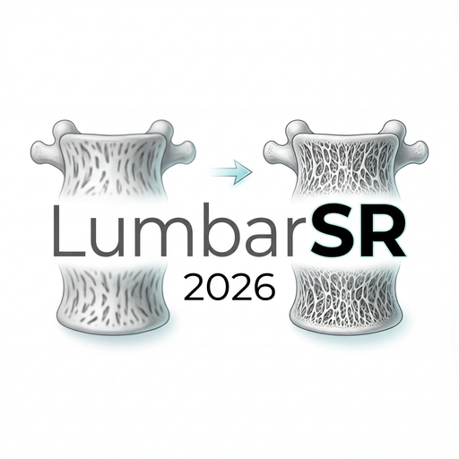
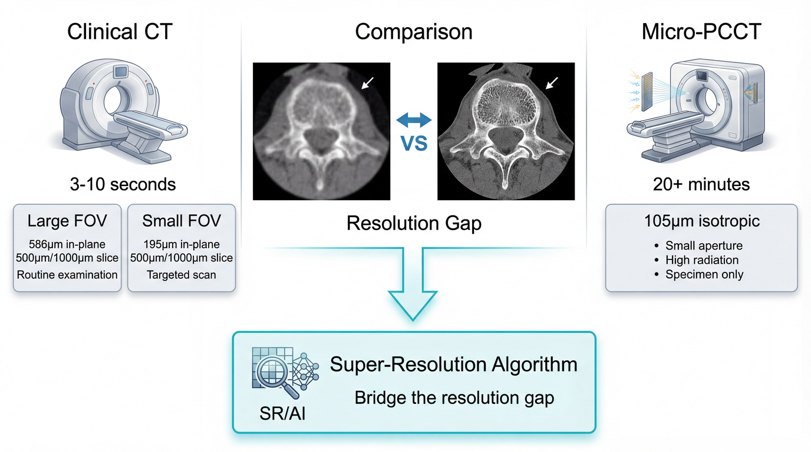

# LumbarSR: A Paired Clinical CT and Photon-Counting Micro-CT Dataset for Human Lumbar Vertebrae

<p align="center">
  
</p>

<p align="center">
  <a href="https://creativecommons.org/licenses/by-nc-sa/4.0/"></a>
  
  
  
</p>

## Overview

Medical computed tomography (CT) plays a crucial role in disease diagnosis, with CT technology having undergone significant evolution over the past half-century—from primary CT to energy-integrating detector CT, and now to photon-counting detector CT (PCCT) systems being deployed in clinical centers worldwide. Low back pain is a prevalent symptom affecting approximately 540 million people globally at any given time, with lumbar vertebral microstructure changes being a potential osseous factor contributing to this condition. However, these microstructural morphological changes remain largely undetectable due to current limitations in standard clinical CT equipment resolution.

This project addresses the critical need for algorithms capable of reconstructing high-resolution bone microstructure from paired regular clinical helical CT lumbar vertebral images to match the quality of state-of-the-art Micro-PCCT. The LumbarSR project provides a unique dataset of 30 paired human dry lumbar vertebrae scanned with both clinical helical CT (at multiple resolution and reconstruction configurations) and Micro-PCCT at 0.1mm super-resolution. This benchmark enables development and evaluation of super-resolution reconstruction algorithms in musculoskeletal imaging, with potential applications in osteoporosis screening, fracture risk assessment, and low back pain investigation.

The technical objective is to develop algorithms that can transform clinical helical CT images (0.5-1.0 mm resolution) into high-resolution images comparable to Micro-PCCT (0.1 mm), representing a 10-200× super-resolution enhancement factor. Success on this benchmark could transform routine lumbar CT scans into diagnostic tools for bone microstructure assessment, advancing AI-based image reconstruction in musculoskeletal radiology.

<p align="center">
  <a href="docs/images/showcase.gif">
    
  </a>
  <br>
  <em>Tri-planar views and 3D bone rendering across different CT resolutions (<a href="docs/images/showcase.gif">Full resolution</a>)</em>
</p>

## Task Description

Given clinical CT images acquired with **soft tissue reconstruction kernel** at two different fields of view (FOV):
- **Small FOV** (195um in-plane resolution)
- **Large FOV** (586um in-plane resolution)

Reconstruct the corresponding high-resolution Micro-PCCT image (105um isotropic resolution).

<p align="center">
  <a href="docs/images/flowchart.png">
    
  </a>
  <br>
  <em>Pipeline overview (<a href="docs/images/flowchart.png">Full resolution</a>)</em>
</p>

## Dataset

### Download

**[Download Dataset (tar.gz)](https://drive.google.com/file/d/1mPK0_i15XPzp1pyydV2uhsMfBuYGjJGy/view?usp=sharing)**

[](https://zenodo.org/)

Zenodo release page placeholder: [https://zenodo.org/](https://zenodo.org/)

The dataset is provided as a compressed tar.gz archive. After downloading, extract it using:

```bash
# Extract the dataset
tar -xzf LumbarSR_Dataset.tar.gz

# This will create a LumbarSR/ directory with the following structure
```

### Directory Structure

```
LumbarSR/
├── original_dicom/              # Original DICOM data
│   ├── Lumbar_01/
│   │   ├── clinical_ct/
│   │   │   ├── 195X_195Y_500Z_S/      # Small FOV, soft kernel
│   │   │   ├── 195X_195Y_1000Z_S/     # Small FOV, soft kernel
│   │   │   ├── 586X_586Y_500Z_S/      # Large FOV, soft kernel
│   │   │   └── 586X_586Y_1000Z_S/     # Large FOV, soft kernel
│   │   └── micro_ct/
│   │       └── *.dcm                   # Original Micro-PCCT DICOM
│   ├── Lumbar_02/
│   │   └── ...
│   └── Lumbar_30/
│       └── ...
├── RegisteredData/              # Processed NIfTI data (ready to use)
│   ├── Lumbar_01/
│   │   ├── Lumbar01_ClinicalCT_195X_195Y_500Z_S_registered.nii.gz
│   │   ├── Lumbar01_ClinicalCT_195X_195Y_1000Z_S_registered.nii.gz
│   │   ├── Lumbar01_ClinicalCT_586X_586Y_500Z_S_registered.nii.gz
│   │   ├── Lumbar01_ClinicalCT_586X_586Y_1000Z_S_registered.nii.gz
│   │   └── Lumbar01_MicroPCCT_105um.nii.gz                          # Ground truth
│   ├── Lumbar_02/
│   │   └── ...
│   └── Lumbar_30/
│       └── ...
├── BoneMask/                    # Released binary bone ROI aligned to RegisteredData
│   ├── Lumbar_01/
│   │   ├── Lumbar01_MicroPCCT_105um_BoneMask.nii.gz
│   │   ├── Lumbar01_ClinicalCT_195X_195Y_500Z_B_registered_BoneMask.nii.gz
│   │   ├── Lumbar01_ClinicalCT_195X_195Y_500Z_S_registered_BoneMask.nii.gz
│   │   ├── Lumbar01_ClinicalCT_195X_195Y_1000Z_B_registered_BoneMask.nii.gz
│   │   ├── Lumbar01_ClinicalCT_195X_195Y_1000Z_S_registered_BoneMask.nii.gz
│   │   ├── Lumbar01_ClinicalCT_586X_586Y_500Z_B_registered_BoneMask.nii.gz
│   │   ├── Lumbar01_ClinicalCT_586X_586Y_500Z_S_registered_BoneMask.nii.gz
│   │   ├── Lumbar01_ClinicalCT_586X_586Y_1000Z_B_registered_BoneMask.nii.gz
│   │   └── Lumbar01_ClinicalCT_586X_586Y_1000Z_S_registered_BoneMask.nii.gz
│   ├── Lumbar_02/
│   │   └── ...
│   └── Lumbar_30/
│       └── ...
└── README.md
```

**Key Points:**
- `original_dicom/`: Contains raw DICOM files for advanced users who want to process from scratch
- `RegisteredData/`: Pre-processed and registered NIfTI files, ready for training (recommended starting point)
- `BoneMask/`: Binary bone ROI volumes aligned to the released `RegisteredData` files
- All clinical CT sequences are rigidly registered to the Micro-PCCT space
- Ground truth files are named `*_MicroPCCT_105um.nii.gz`
- Each sample contains 9 BoneMask files: 1 `MicroPCCT` mask and 8 registered clinical-sequence masks
- Within one FOV, the same released mask is reused across `B/S` kernels and `500/1000` slice-thickness reconstructions

### Recommended Split

| Usage | Samples |
|-------|---------|
| Training / development | `Lumbar_01` to `Lumbar_25` |
| Reference test set | `Lumbar_26` to `Lumbar_30` |

### Input Data (Clinical CT)

For each sample, we provide 4 sequences with soft tissue kernel:

| Sequence | In-plane Resolution | Slice Thickness | FOV |
|----------|---------------------|-----------------|-----|
| 195X_195Y_500Z_S | 195um | 500um | Small |
| 195X_195Y_1000Z_S | 195um | 1000um | Small |
| 586X_586Y_500Z_S | 586um | 500um | Large |
| 586X_586Y_1000Z_S | 586um | 1000um | Large |

### Ground Truth (Micro-PCCT)

- Resolution: 105um isotropic
- Format: NIfTI (.nii.gz)
- Data type: int16 (Hounsfield Units)

### Dataset Statistics

- **Training Set**: 30 samples, 212,805 slices total (avg 7,093.5 slices/case, registered to 105μm isotropic)

## Evaluation Metrics

### Image Quality Metrics

The following image-quality metrics are reported within the released `BoneMask` ROI:

- **PSNR** (Peak Signal-to-Noise Ratio) - measured in dB, higher is better ↑
- **SSIM** (Structural Similarity Index) - range [0, 1], higher is better ↑
- **MAE** (Mean Absolute Error) - lower is better ↓

### CT Window Settings

Public image-quality evaluation reports three CT window settings:

| Window | Window Center (WC) | Window Width (WW) | Description |
|--------|-------------------|-------------------|-------------|
| Raw | - | - | Original HU values (-1024 ~ 3071) |
| Bone | 400 | 1800 | Bone structure visualization |
| Soft Tissue | 40 | 400 | Soft tissue visualization |

## Getting Started

### Environment Setup

We recommend a standard local Python environment for training and evaluation:

```bash
git clone https://github.com/frankzhangrp/LumbarSR-Challenge.git
cd LumbarSR-Challenge

conda create -n lumbarsr python=3.10 -y
conda activate lumbarsr

pip install --upgrade pip
pip install -r requirements.txt
```

Environment checklist:
- PyTorch ≥ 2.0
- MONAI ≥ 1.2
- nibabel, pydicom, SimpleITK
- numpy, scipy, scikit-image

Optional checks:

```bash
python -c "import torch; print(torch.__version__)"
python -c "import monai; print(monai.__version__)"
python -c "import nibabel, pydicom, SimpleITK, scipy, skimage; print('deps ok')"
```

## Repository Contents

The public repository currently contains four main parts:

| Directory | Status | Description |
|-----------|--------|-------------|
| `baseline/` | Public | Rigid registration baseline based on ANTs, including `register_ants.py` and `batch_register.py` |
| `methods/` | Public | Interpolation, SRCNN, and UNet baselines with training and inference scripts |
| `evaluation/` | Public | Image quality evaluation scripts for PSNR, SSIM, MAE, and trabecular summary statistics |
| `docs/` | Public | GitHub Pages website, visualizations, and benchmark result pages |

The current release covers the registration baseline, super-resolution baselines, evaluation scripts, the released `BoneMask` ROI files, and the project website.

Current public benchmark status (`2026-04-06`):

- Public method code currently covers interpolation, `SRCNN`, and `UNet`; `ESRGAN` and `SwinIR` are benchmark-page result entries in this release
- The released benchmark pages already reflect the refreshed `BoneMask`-ROI protocol for the previously released methods: registered clinical CT baseline, interpolation baselines, `SRCNN`, and `UNet`
- Public `masked` image-quality metrics are interpreted inside the released sequence-level `BoneMask` ROI
- Public bone morphometry summaries currently cover the released subset (`Micro-PCCT`, registered clinical CT baseline, `SRCNN`, `UNet`, `ESRGAN`, `SwinIR`) for both `195X_195Y_1000Z_S` and `586X_586Y_1000Z_S`
- `ESRGAN` public image-quality metrics and bone morphometry rows have been filled in on `2026-04-06`
- `SwinIR` public image-quality metrics and bone morphometry rows have now been filled in on `2026-04-06`

## Registration Baseline and Mask Evaluation

The public repository already includes rigid registration code in [`baseline/register_ants.py`](baseline/register_ants.py) and [`baseline/batch_register.py`](baseline/batch_register.py).

### Current Public Evaluation Masks

- Public SR evaluation uses the released sequence-level `BoneMask` ROI aligned to each `RegisteredData` volume
- The public `BoneMask` files are provided as binary reference masks in `LumbarSR/BoneMask/`

### Registration Evaluation

We report registration quality within the released `BoneMask` ROI using `Dice`, `HD95`, and `HD`. These metrics are provided as a practical reference for the final registration quality.

| Method | ROI | Dice ↑ | HD95 ↓ | HD ↓ |
|--------|-----|--------|--------|------|
| ANTs rigid baseline (`195X_195Y_500Z_B`) | BoneMask ROI | `0.9826 ± 0.0017` | `0.2266 ± 0.0131 mm` | `1.1476 ± 0.5960 mm` |
| ANTs rigid baseline (`586X_586Y_500Z_B`) | BoneMask ROI | `0.9811 ± 0.0023` | `0.2887 ± 0.0358 mm` | `0.9095 ± 0.2725 mm` |
| ANTs rigid baseline (overall) | BoneMask ROI | `0.9818 ± 0.0021` | `0.2576 ± 0.0411 mm` | `1.0285 ± 0.4785 mm` |

### Bone Morphometry

The public benchmark pages report the following ROI-based bone morphometry measurements:

| Category | Metrics |
|----------|---------|
| Core trabecular morphometry | `BV/TV`, `Tb.Th`, `Tb.Sp`, `Tb.N` |
| Released VOI definition | derived from the released `BoneMask` and used consistently for all public morphometry statistics |

Current public subset (`195X_195Y_1000Z_S`):

| Method / Data | BV/TV | Tb.Th (mm) | Tb.Sp (mm) | Tb.N (mm^-1) |
|---------------|-------|------------|------------|--------------|
| Micro-PCCT reference | `0.2208 ± 0.0174` | `0.2573 ± 0.0141` | `0.3647 ± 0.0192` | `0.8608 ± 0.0881` |
| Registered clinical CT baseline | `0.0055 ± 0.0029` | `0.5837 ± 0.1179` | `4.1319 ± 1.1314` | `0.0097 ± 0.0056` |
| SRCNN | `0.0605 ± 0.0212` | `0.7673 ± 0.0865` | `0.9809 ± 0.2448` | `0.0773 ± 0.0202` |
| UNet | `0.0931 ± 0.0235` | `0.4324 ± 0.0550` | `0.4565 ± 0.0574` | `0.2133 ± 0.0346` |
| ESRGAN | `0.1330 ± 0.0239` | `0.2740 ± 0.0112` | `0.3941 ± 0.0249` | `0.4841 ± 0.0773` |
| SwinIR | `0.0415 ± 0.0140` | `0.7371 ± 0.0845` | `1.3594 ± 0.3529` | `0.0549 ± 0.0127` |

Current public subset (`586X_586Y_1000Z_S`):

| Method / Data | BV/TV | Tb.Th (mm) | Tb.Sp (mm) | Tb.N (mm^-1) |
|---------------|-------|------------|------------|--------------|
| Micro-PCCT reference | `0.2208 ± 0.0174` | `0.2573 ± 0.0141` | `0.3647 ± 0.0192` | `0.8608 ± 0.0881` |
| Registered clinical CT baseline | `0.0026 ± 0.0018` | `0.5338 ± 0.1322` | `5.0502 ± 1.8719` | `0.0053 ± 0.0044` |
| SRCNN | `0.1271 ± 0.0204` | `0.6565 ± 0.0739` | `0.4540 ± 0.0425` | `0.1928 ± 0.0104` |
| UNet | `0.1227 ± 0.0254` | `0.4639 ± 0.0467` | `0.4421 ± 0.0459` | `0.2624 ± 0.0300` |
| ESRGAN | `0.1506 ± 0.0209` | `0.2730 ± 0.0089` | `0.3710 ± 0.0160` | `0.5511 ± 0.0702` |
| SwinIR | `0.0486 ± 0.0144` | `0.4010 ± 0.0203` | `0.9216 ± 0.2053` | `0.1198 ± 0.0305` |

Among interpolation baselines, only `Nearest` is retained in the public morphometry comparison tables; `SwinIR` morphometry entries have now been added for the released subset.

### Paired Statistical Comparison vs Micro-PCCT

For the released test subset, we additionally report a paired statistical comparison against the `Micro-PCCT` reference:

- Test: one-sided exact `Wilcoxon signed-rank test`
- Pairing: same released test case, reported separately for each FOV
- Sample size: `n = 5` per FOV
- Note: with `n = 5`, the smallest attainable exact one-sided `p` value is `0.03125`
- Direction: `BV/TV` and `Tb.N` test `pred < Micro-PCCT`; `Tb.Th` and `Tb.Sp` test `pred > Micro-PCCT`

Signed mean difference, `pred - Micro-PCCT` (`195X_195Y_1000Z_S`):

| Method | ΔBV/TV | ΔTb.Th (mm) | ΔTb.Sp (mm) | ΔTb.N (mm^-1) |
|---|---:|---:|---:|---:|
| Registered clinical CT baseline | -0.2125 | +0.3761 | +3.8776 | -0.8398 |
| Nearest | -0.2125 | +0.3761 | +3.8776 | -0.8398 |
| SRCNN | -0.1556 | +0.5861 | +0.5512 | -0.7762 |
| UNet | -0.1217 | +0.1907 | +0.0951 | -0.6357 |
| ESRGAN | -0.0878 | +0.0167 | +0.0293 | -0.3767 |
| SwinIR | -0.1793 | +0.4798 | +0.9947 | -0.8059 |

One-sided exact `Wilcoxon` `p` values vs `Micro-PCCT` (`195X_195Y_1000Z_S`):

| Method | BV/TV p | Tb.Th p | Tb.Sp p | Tb.N p |
|---|---:|---:|---:|---:|
| Registered clinical CT baseline | 0.03125 | 0.03125 | 0.03125 | 0.03125 |
| Nearest | 0.03125 | 0.03125 | 0.03125 | 0.03125 |
| SRCNN | 0.03125 | 0.03125 | 0.03125 | 0.03125 |
| UNet | 0.03125 | 0.03125 | 0.03125 | 0.03125 |
| ESRGAN | 0.03125 | 0.03125 | 0.09375 | 0.03125 |
| SwinIR | 0.03125 | 0.03125 | 0.03125 | 0.03125 |

Signed mean difference, `pred - Micro-PCCT` (`586X_586Y_1000Z_S`):

| Method | ΔBV/TV | ΔTb.Th (mm) | ΔTb.Sp (mm) | ΔTb.N (mm^-1) |
|---|---:|---:|---:|---:|
| Registered clinical CT baseline | -0.2167 | +0.2665 | +5.0664 | -0.8493 |
| Nearest | -0.2167 | +0.2665 | +5.0664 | -0.8493 |
| SRCNN | -0.0864 | +0.4665 | +0.0593 | -0.6719 |
| UNet | -0.0920 | +0.2314 | +0.0863 | -0.5960 |
| ESRGAN | -0.0702 | +0.0156 | +0.0063 | -0.3097 |
| SwinIR | -0.1722 | +0.1437 | +0.5568 | -0.7410 |

One-sided exact `Wilcoxon` `p` values vs `Micro-PCCT` (`586X_586Y_1000Z_S`):

| Method | BV/TV p | Tb.Th p | Tb.Sp p | Tb.N p |
|---|---:|---:|---:|---:|
| Registered clinical CT baseline | 0.03125 | 0.03125 | 0.03125 | 0.03125 |
| Nearest | 0.03125 | 0.03125 | 0.03125 | 0.03125 |
| SRCNN | 0.03125 | 0.03125 | 0.09375 | 0.03125 |
| UNet | 0.03125 | 0.03125 | 0.03125 | 0.03125 |
| ESRGAN | 0.03125 | 0.03125 | 0.40625 | 0.03125 |
| SwinIR | 0.03125 | 0.03125 | 0.03125 | 0.03125 |

## Baseline Methods

We currently provide three released baseline implementations in the [`methods/`](methods/) directory:

### 1. Interpolation Baselines

Traditional interpolation methods (no training required):

```bash
# Run bicubic interpolation (recommended baseline)
python methods/interpolation.py \
  --method bicubic \
  --data-root ./data/RegisteredData \
  --output-root ./results
```

Available methods: `nearest`, `trilinear`, `bicubic`, `lanczos`

### 2. SRCNN (Super-Resolution CNN)

Deep learning approach with ~60K parameters:

```bash
# Training
python methods/train.py \
  --model srcnn \
  --data-root ./data/RegisteredData \
  --output-dir ./checkpoints \
  --epochs 100 \
  --batch-size 8

# Inference
python methods/inference.py \
  --model srcnn \
  --checkpoint checkpoints/srcnn_best.pth \
  --data-root ./data/RegisteredData \
  --output-root ./results
```

### 3. UNet

U-shaped architecture with encoder-decoder and skip connections (~30M parameters):

```bash
# Training
python methods/train.py \
  --model unet \
  --data-root ./data/RegisteredData \
  --output-dir ./checkpoints \
  --epochs 100 \
  --batch-size 4

# Inference
python methods/inference.py \
  --model unet \
  --checkpoint checkpoints/unet_best.pth \
  --data-root ./data/RegisteredData \
  --output-root ./results
```

### Additional Baselines

| Method | Status | Notes |
|--------|--------|-------|
| ESRGAN | Image metrics + morphometry released | RRDB-based adversarial super-resolution baseline |
| SwinIR | Image metrics + morphometry released | Transformer-based super-resolution baseline |

### Baseline Performance

**Experimental Setup:**
- **Training Set**: Lumbar_01 to Lumbar_25 (25 samples)
- **Test Set**: Lumbar_26 to Lumbar_30 (5 samples)
- **Training**: Deep learning methods trained on 25 samples with single-sequence soft-kernel input by default
- **Evaluation**: Metrics computed as mean ± standard deviation across test set

#### PSNR Results (dB) ↑

| Method | Small FOV (195μm × 195μm) | | | | | | Large FOV (586μm × 586μm) | | | | | |
|--------|---|---|---|---|---|---|---|---|---|---|---|---|
| | **Full** | | | **Masked** | | | **Full** | | | **Masked** | | |
| | Raw | Bone | Soft | Raw | Bone | Soft | Raw | Bone | Soft | Raw | Bone | Soft |
| **Baseline** | 21.94±0.67 | 18.94±0.45 | 17.20±0.38 | 11.86±0.77 | 8.85±0.61 | 7.12±0.61 | 22.01±0.66 | 18.98±0.41 | 17.30±0.34 | 12.04±0.67 | 9.01±0.50 | 7.33±0.51 |
| **UNet** | 21.94±0.67 | 18.94±0.45 | 17.20±0.38 | 11.86±0.77 | 8.85±0.61 | 7.12±0.61 | 22.01±0.66 | 18.98±0.41 | 17.30±0.34 | 12.04±0.67 | 9.01±0.50 | 7.33±0.51 |
| **SRCNN** | **23.64±0.50** | **20.04±0.39** | **18.00±0.35** | **12.87±0.35** | **9.26±0.32** | 7.22±0.30 | **23.99±0.58** | **20.31±0.42** | **18.07±0.37** | **13.18±0.38** | **9.50±0.27** | 7.25±0.21 |
| **ESRGAN** | 21.87±0.63 | 18.78±0.50 | 17.08±0.40 | 9.73±0.45 | 6.60±0.37 | 4.90±0.34 | 22.64±0.48 | 19.22±0.39 | 17.44±0.33 | 10.49±0.29 | 7.04±0.28 | 5.26±0.29 |
| **SwinIR** | 22.82±0.59 | 19.72±0.42 | 17.55±0.34 | 10.75±0.37 | 7.62±0.35 | 5.51±0.28 | 23.31±0.53 | 20.22±0.35 | 17.88±0.32 | 11.21±0.29 | 8.05±0.27 | 5.76±0.22 |
| **Nearest** | 23.74±0.54 | 20.11±0.42 | 18.00±0.36 | 13.04±0.35 | 9.40±0.30 | 7.29±0.26 | 23.71±0.54 | 20.19±0.41 | 18.00±0.36 | 13.03±0.34 | 9.51±0.26 | 7.31±0.23 |

#### SSIM Results ↑

| Method | Small FOV (195μm × 195μm) | | | | | | Large FOV (586μm × 586μm) | | | | | |
|--------|---|---|---|---|---|---|---|---|---|---|---|---|
| | **Full** | | | **Masked** | | | **Full** | | | **Masked** | | |
| | Raw | Bone | Soft | Raw | Bone | Soft | Raw | Bone | Soft | Raw | Bone | Soft |
| **Baseline** | 0.92±0.00 | 0.94±0.00 | 0.95±0.00 | 0.92±0.00 | 0.94±0.00 | 0.95±0.00 | 0.92±0.00 | 0.94±0.00 | 0.95±0.00 | 0.92±0.00 | 0.94±0.00 | 0.95±0.00 |
| **UNet** | 0.93±0.01 | 0.95±0.00 | 0.95±0.00 | 0.93±0.01 | 0.95±0.00 | **0.95±0.00** | **0.94±0.00** | **0.95±0.00** | **0.95±0.00** | **0.94±0.00** | **0.95±0.00** | **0.95±0.00** |
| **SRCNN** | 0.93±0.00 | 0.95±0.00 | 0.95±0.00 | 0.93±0.00 | 0.95±0.00 | 0.95±0.00 | 0.93±0.00 | 0.95±0.00 | 0.95±0.00 | 0.93±0.00 | 0.95±0.00 | 0.95±0.00 |
| **ESRGAN** | 0.93±0.00 | 0.94±0.00 | 0.94±0.00 | 0.82±0.04 | 0.82±0.04 | 0.82±0.04 | 0.93±0.00 | 0.95±0.00 | 0.95±0.00 | 0.82±0.03 | 0.82±0.04 | 0.82±0.03 |
| **SwinIR** | 0.92±0.00 | 0.94±0.00 | 0.95±0.00 | 0.92±0.00 | 0.94±0.00 | 0.95±0.00 | 0.92±0.00 | 0.94±0.00 | 0.95±0.00 | 0.92±0.00 | 0.94±0.00 | 0.95±0.00 |
| **Nearest** | 0.92±0.00 | 0.94±0.00 | 0.95±0.00 | 0.92±0.00 | 0.94±0.00 | 0.95±0.00 | 0.92±0.00 | 0.94±0.00 | 0.95±0.00 | 0.92±0.00 | 0.94±0.00 | 0.95±0.00 |

#### MAE Results ↓

| Method | Small FOV (195μm × 195μm) | | | | | | Large FOV (586μm × 586μm) | | | | | |
|--------|---|---|---|---|---|---|---|---|---|---|---|---|
| | **Full** | | | **Masked** | | | **Full** | | | **Masked** | | |
| | Raw | Bone | Soft | Raw | Bone | Soft | Raw | Bone | Soft | Raw | Bone | Soft |
| **Baseline** | 0.01±0.00 | 0.02±0.00 | 0.02±0.00 | 0.15±0.02 | 0.19±0.03 | 0.21±0.03 | 0.01±0.00 | 0.02±0.00 | 0.02±0.00 | 0.14±0.02 | 0.18±0.02 | 0.20±0.02 |
| **UNet** | **0.01±0.00** | 0.01±0.00 | 0.02±0.00 | 0.14±0.01 | 0.18±0.01 | 0.21±0.01 | **0.01±0.00** | **0.02±0.00** | **0.02±0.00** | **0.14±0.01** | 0.18±0.01 | 0.21±0.01 |
| **SRCNN** | **0.01±0.00** | **0.02±0.00** | **0.02±0.00** | **0.14±0.01** | **0.18±0.01** | **0.21±0.01** | **0.01±0.00** | **0.02±0.00** | **0.02±0.00** | **0.14±0.01** | **0.18±0.01** | **0.21±0.01** |
| **ESRGAN** | 0.01±0.00 | 0.02±0.00 | 0.02±0.00 | 0.22±0.01 | 0.31±0.02 | 0.35±0.03 | 0.01±0.00 | 0.02±0.00 | 0.02±0.00 | 0.21±0.01 | 0.28±0.02 | 0.32±0.02 |
| **SwinIR** | 0.01±0.00 | 0.02±0.00 | 0.02±0.00 | 0.21±0.01 | 0.28±0.02 | 0.32±0.02 | 0.01±0.00 | 0.02±0.00 | 0.02±0.00 | 0.20±0.01 | 0.27±0.01 | 0.31±0.01 |
| **Nearest** | 0.01±0.00 | 0.02±0.00 | 0.02±0.00 | 0.15±0.02 | 0.19±0.03 | 0.21±0.03 | 0.01±0.00 | 0.02±0.00 | 0.02±0.00 | 0.14±0.02 | 0.18±0.02 | 0.20±0.02 |

For detailed instructions, see [`methods/README.md`](methods/README.md).

## Recommended Usage Policy

1. **Official Data**: Use the released LumbarSR training set as the primary development data.

2. **External Data**: External datasets may be used for pre-training or supplementary training. Please clearly document the data sources and approximate scale in any report or publication.

3. **Pre-trained / Foundation Models**: Publicly available pre-trained models and foundation models may be used. Please document the model name, version, and checkpoint when applicable.

4. **Synthetic Data**: Synthetic data generation, simulation, augmentation, or self-training strategies may be used and should be briefly described.

5. **Evaluation Integrity**: Do not use hidden ground truth or any form of test leakage. Evaluation should remain fully automatic and reproducible.

## Organizers

- **Ping Wang***, Institute of Diagnostic and Interventional Radiology, Shanghai Sixth People's Hospital Affiliated to Shanghai Jiao Tong University School of Medicine
- **Ruipeng Zhang***, Institute of Diagnostic and Interventional Radiology, Shanghai Sixth People's Hospital Affiliated to Shanghai Jiao Tong University School of Medicine
- **Mengfei Wang**, School of Information and Intelligent Science, Donghua University
- **Zhenzhen Cao**, Basic Medical Science, Kunming Medical University
- **Xuefei Hu**, Basic Medical Science, Tarim University School of Medicine
- **Yuehua Li**✉, Institute of Diagnostic and Interventional Radiology, Shanghai Sixth People's Hospital Affiliated to Shanghai Jiao Tong University School of Medicine (liyuehua77@sjtu.edu.cn)

\* Equal contribution

## Citation

If you use this dataset, please cite:

```bibtex
@misc{lumbarsr2026,
  title={LumbarSR: A Paired Clinical CT and Photon-Counting Micro-CT Dataset for Human Lumbar Vertebrae},
  author={Wang, Ping and Zhang, Ruipeng and Wang, Mengfei and Cao, Zhenzhen and Hu, Xuefei and Li, Yuehua},
  year={2026},
  url={https://github.com/frankzhangrp/LumbarSR-Challenge}
}
```

## Contact

- Email: zhangrp@sjtu.edu.cn
- GitHub: [@frankzhangrp](https://github.com/frankzhangrp)

## License

This dataset is released under [CC BY-NC-SA 4.0](https://creativecommons.org/licenses/by-nc-sa/4.0/).
